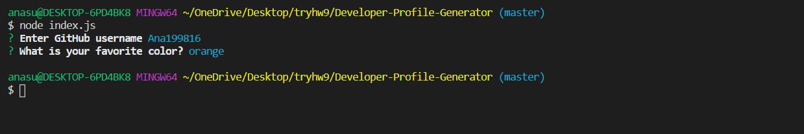

# Developer-Profile-Generator
 09 homework

# Project Description
This app is run in the terminal using Node. To use the app first type "npm install" and hit "enter" to install all required dependencies.

The Developer Profile Generator uses Inquirer to prompt the user for a GitHub user name and a color in the terminal. The app uses this information to query the GitHub data API and get information on the GitHub user that was entered. The app then uses FS to generate an html file ("profile.html") displaying information about the GitHub user including their profile picture, bio, number of repositories, etc. It also contains links to a google map of the GitHub user's location, to their GitHub profile, and to their blog. The information is displayed on cards that have a background color that matches the color the user entered in the Inquirer prompt (the color must be a recognized color name).
# Screenshots  
 
 

 # Links :

 https://ana199816.github.io/homework-09/ - WebSite

 https://github.com/Ana199816/homework-09 - GitHub

Technologies and Techniques Used
This project demonstrates the use of several web development technologies. It uses Node to run the Javascript rather than a web browser. It uses the native FS module for the creation of an HTML file, and also uses third-party node modules including Inquirer to collect and use user inputs, Axios to perform http requests to third-party data APIs, and Electron for the generation of a PDF file. Template literals are used to generate HTML and easily insert javascript variables in the required locations. The GitHub data API response is manipulated in order to capture the desired information about a GitHub user. Additionally, object destructuring is used to neatly capture the information entered by the user via the Inquirer module.